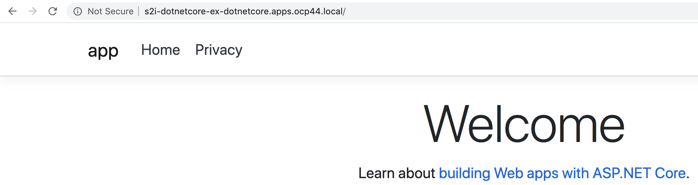
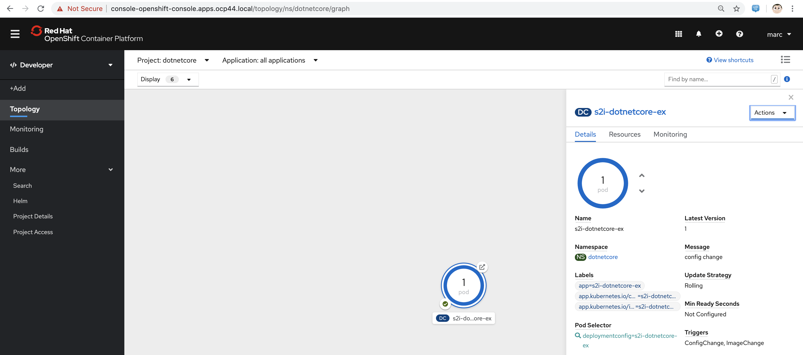

----
https://developers.redhat.com/blog/2020/01/17/net-core-on-red-hat-platforms/
----

----
oc new-project dotnetcore
----

----
oc create -f https://raw.githubusercontent.com/redhat-developer/s2i-dotnetcore/master/dotnet_imagestreams_rhel8.json
----

----
imagestream.image.openshift.io/dotnet created
imagestream.image.openshift.io/dotnet-runtime created
----

----
oc new-app dotnet:3.1~https://github.com/redhat-developer/s2i-dotnetcore-ex#dotnetcore-3.1 --context-dir=app
----

----
oc get pods
NAME                         READY   STATUS      RESTARTS   AGE
s2i-dotnetcore-ex-1-build    0/1     Completed   0          2m12s
s2i-dotnetcore-ex-1-deploy   0/1     Completed   0          44s
s2i-dotnetcore-ex-1-zpmpw    1/1     Running     0          37s
----

----
oc get svc
NAME                TYPE        CLUSTER-IP       EXTERNAL-IP   PORT(S)    AGE
s2i-dotnetcore-ex   ClusterIP   172.30.219.128   <none>        8080/TCP   115s
----

----
oc expose svc/s2i-dotnetcore-ex
----

----
route.route.openshift.io/s2i-dotnetcore-ex exposed
----

----
oc get route
NAME                HOST/PORT                                       PATH   SERVICES            PORT       TERMINATION   WILDCARD
s2i-dotnetcore-ex   s2i-dotnetcore-ex-dotnetcore.apps.ocp44.local          s2i-dotnetcore-ex   8080-tcp                 None
----

