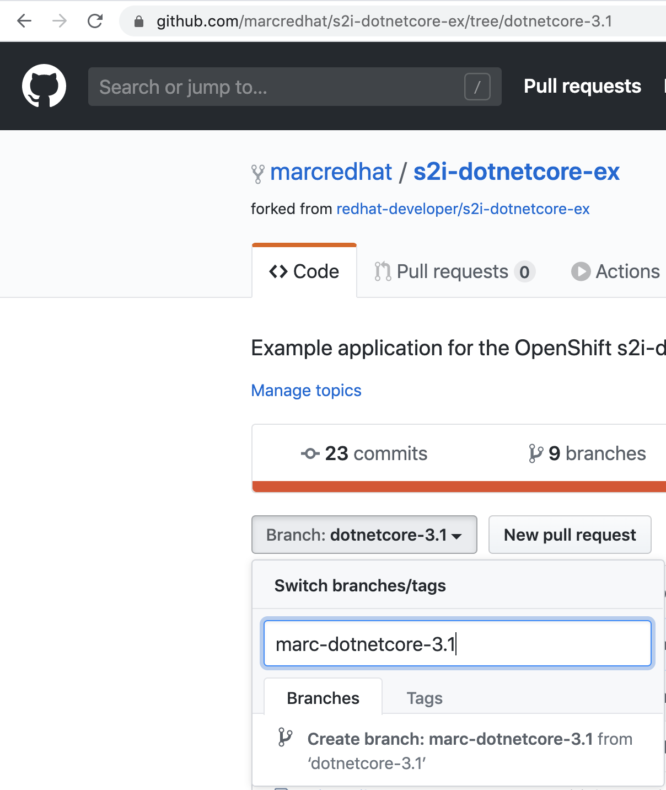
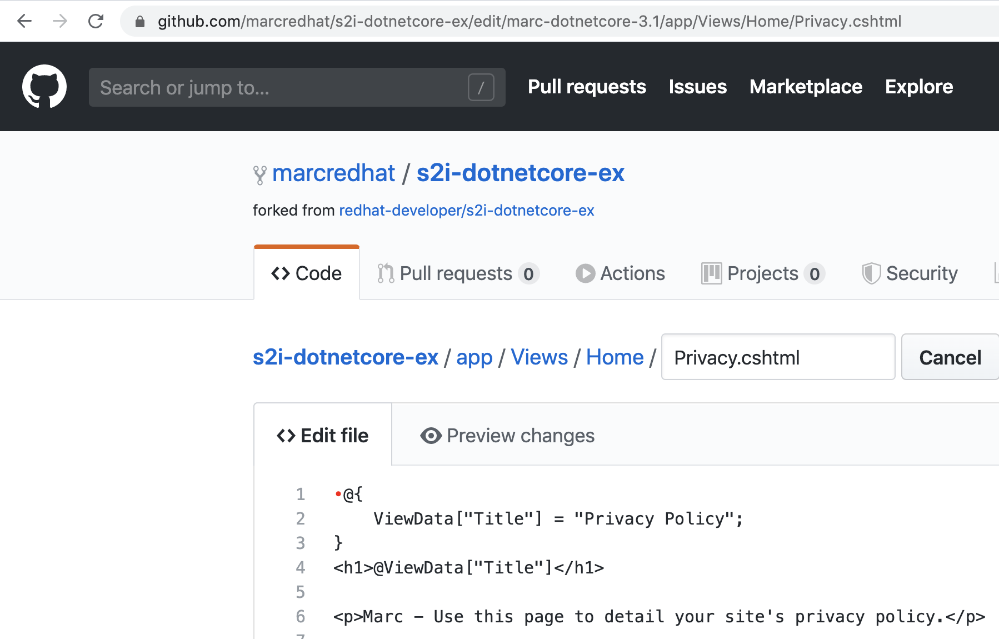
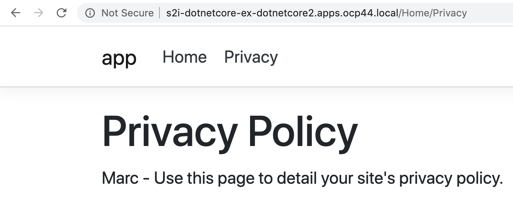

----
Fork https://raw.githubusercontent.com/redhat-developer/s2i-dotnetcore

In my case, https://github.com/marcredhat/s2i-dotnetcore-ex
----

----
oc new-project dotnetcore2
----

----
oc create -f https://raw.githubusercontent.com/redhat-developer/s2i-dotnetcore/master/dotnet_imagestreams_rhel8.json
----

----
imagestream.image.openshift.io/dotnet created
imagestream.image.openshift.io/dotnet-runtime created
----

----
Create a new branch
----

----
Change some code 
----

----
oc new-app dotnet:3.1~https://github.com/marcredhat/s2i-dotnetcore-ex#marc-dotnetcore-3.1 --context-dir=app
----

----
oc expose svc/s2i-dotnetcore-ex
route.route.openshift.io/s2i-dotnetcore-ex exposed
----

----
oc get route
NAME                HOST/PORT                                        PATH   SERVICES            PORT       TERMINATION   WILDCARD
s2i-dotnetcore-ex   s2i-dotnetcore-ex-dotnetcore2.apps.ocp44.local          s2i-dotnetcore-ex   8080-tcp                 None
----

----
Result
----

