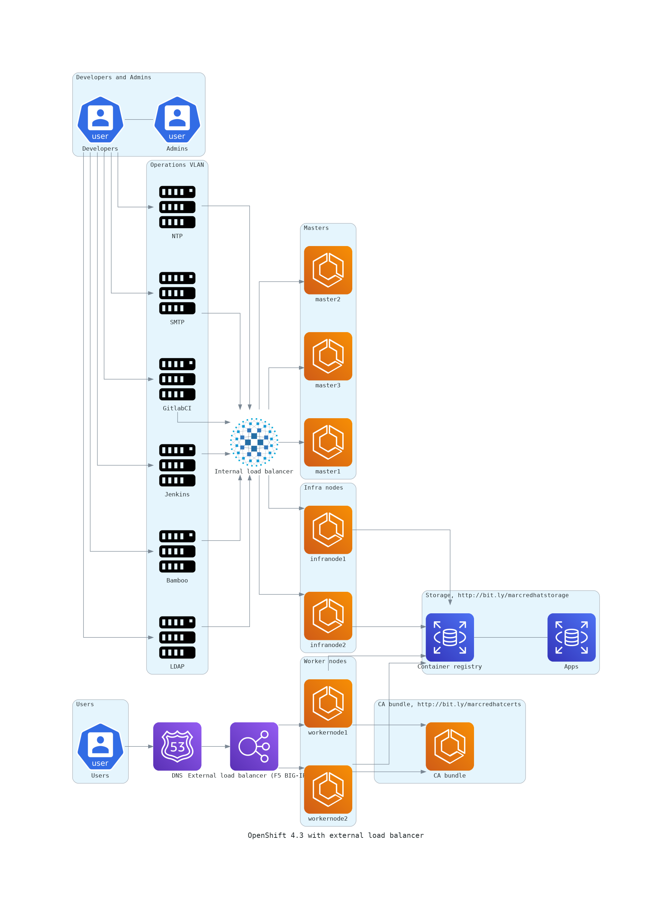

----
1) Install diagrams on RHEL 8.2
----

----
Install Anaconda as shown as https://linuxize.com/post/how-to-install-anaconda-on-centos-8/
conda install graphviz
pip install diagrams --user
----

----
2) wget https://raw.githubusercontent.com/marcredhat/workshop/master/diagramsascode/ocpnetworkdiagram.py
----

----
3) python ocpnetworkdiagram.py
----

----
Generated diagram
----

