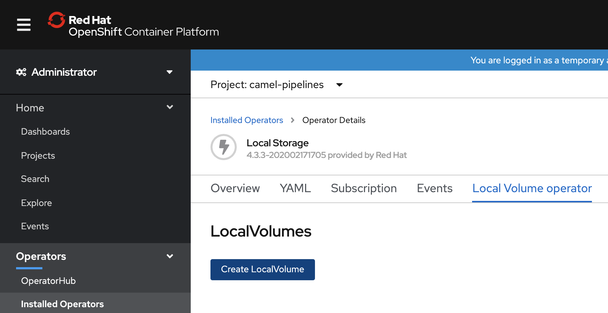
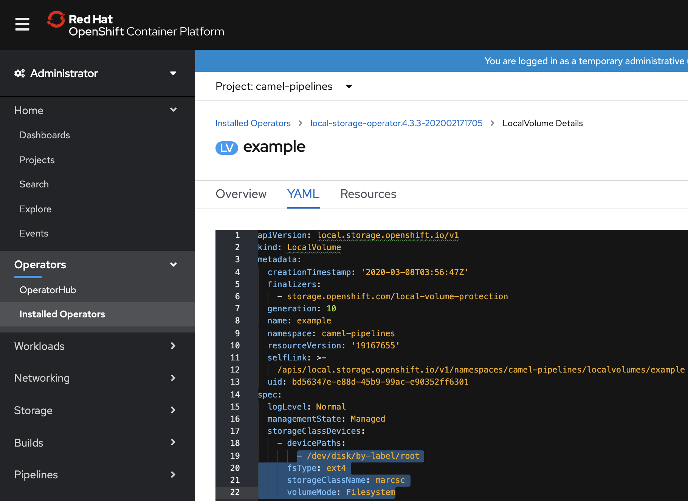

----
See https://docs.openshift.com/container-platform/4.3/storage/persistent_storage/persistent-storage-local.html
----

----
1. Install the Local Storage Operator
2. Create a Local Volume (screenshots below)
2a) Check your device path on the nodes (ssh core@worker-x.ocp43.local); in my case, it's /dev/disk/by-label/root
2b) choose a storageClassName; in my case, marcsc
----

----
storageClassDevices:
    - devicePaths:
        - /dev/disk/by-label/root
      fsType: ext4
      storageClassName: marcsc
      volumeMode: Filesystem
----

----
3) oc adm policy add-cluster-role-to-user cluster-admin system:serviceaccount:camel-pipelines:local-storage-admin
----

----
4) Ensure that /mnt/local-storage/<your storage class name> 
exists on your nodes.

In my case,
ssh core@worker-1.ocp43.local
[core@worker-1 ~]$
cd /mnt/local-storage
sudo mkdir marcsc
----

----
Check that PVs are created
oc get pv
NAME                CAPACITY   ACCESS MODES   RECLAIM POLICY   STATUS      CLAIM                            STORAGECLASS   REASON   AGE
local-pv-10f8b58b   100Gi      RWO            Delete           Available                                    marcsc                  123m
local-pv-1a712043   100Gi      RWO            Delete           Available                                    marcsc                  123m
local-pv-2c3a30c0   10Gi       RWO            Delete           Bound       camel-pipelines/maven-repo-pvc   marcsc                  123m
local-pv-5fd5a308   10Gi       RWO            Delete           Available                                    marcsc                  123m
local-pv-a0d32d79   10Gi       RWO            Delete           Available                                    marcsc                  123m
local-pv-c8bb60de   100Gi      RWO            Delete           Bound       camel-pipelines/local-pvc-name   marcsc                  123m

----

----
Create a PVC using your storage class name
----

----
kind: PersistentVolumeClaim
apiVersion: v1
metadata:
  name: local-pvc-name
spec:
  accessModes:
  - ReadWriteOnce
  volumeMode: Filesystem
  resources:
    requests:
      storage: 100Gi
  storageClassName: marcsc
----

----
https://raw.githubusercontent.com/tektoncd/pipeline/master/examples/v1beta1/taskruns/workspace.yaml
----

== Issues with PVC stuck at "Terminating"

----
Solved as follows:
kubectl patch pvc local-pvc-name -p '{"metadata":{"finalizers":null}}'
kubectl patch pv local-pv-c8bb60de -p '{"metadata":{"finalizers":null}}'

By default, the finalizer value is set to 'protect' which will block the deletion. 
More about finalizers here :
https://kubernetes.io/docs/tasks/access-kubernetes-api/custom-resources/custom-resource-definitions/#finalizers
----
