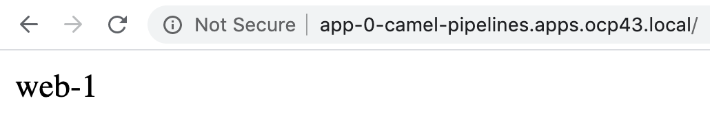

----
See https://kubernetes.io/docs/tutorials/stateful-application/basic-stateful-set/
We are going to create an Nginx Stateful Set using the storage class created by the Local Storage Operator (marcsc).

oc create -f https://raw.githubusercontent.com/marcredhat/workshop/master/localstorageoperator/nginx_stateful_set_using_the_storage_class_created_by_local_storage_operator.yaml
----

----
for i in 0 1; do kubectl exec web-$i -- sh -c 'echo $(hostname) > /usr/share/nginx/html/index.html'; done

for i in 0 1; do kubectl exec -it web-$i -- curl localhost; done
web-0
web-1
----

----
kubectl delete pod -l app=nginx
----

----
for i in 0 1; do kubectl exec -it web-$i -- curl localhost; done
web-0
web-1
----

----
Even though web-0 and web-1 were rescheduled, they continue to serve their hostnames 
because the PersistentVolumes associated with their PersistentVolumeClaims are remounted to their volumeMounts. 
No matter what node web-0and web-1 are scheduled on, 
their PersistentVolumes will be mounted to the appropriate mount points.
----

----
Default Kubernetes service type is ClusterIP.

oc get svc | grep nginx
nginx                    ClusterIP      None             <none>        80/TCP                                          156m

With ClusterIP None, no load-balancing is done and no cluster IP is allocated for this service. 
Only DNS is automatically configured. 
When you run a DNS query for headless service, you will get the list of the Pods IPs.
Usually, the client DNS chooses the first DNS record.
----

----
oc expose svc/nginx

oc get route
NAME              HOST/PORT                                          PATH   SERVICES          PORT   TERMINATION   WILDCARD
app-0             app-0-camel-pipelines.apps.ocp43.local                    app-0             80                   None
nginx             nginx-camel-pipelines.apps.ocp43.local                    nginx             web                  None
----

----
Let's created a DaemonSet with DNS tools.
We'll connect to one of pods and run a DNS query for the headless service
----

----          
oc create -f https://raw.githubusercontent.com/marcredhat/workshop/master/localstorageoperator/dnstoolsdaemonset.yaml
oc label node worker-1.ocp43.local dnstools=dnstools-node
oc label node worker-2.ocp43.local dnstools=dnstools-node

oc rsh dnstools-rsdxs
#
# host nginx
nginx.camel-pipelines.svc.cluster.local has address 10.128.3.65
nginx.camel-pipelines.svc.cluster.local has address 10.129.1.104
----

----
kubectl run -i --tty --image busybox:1.28 dns-test --restart=Never --rm   nslookup web-0.nginx

Server:    172.30.0.10
Address 1: 172.30.0.10 dns-default.openshift-dns.svc.cluster.local

Name:      web-0.nginx
Address 1: 10.128.3.35 web-0.nginx.camel-pipelines.svc.cluster.local
pod "dns-test" deleted
----

----
Exposing StatefulSets
See https://itnext.io/exposing-statefulsets-in-kubernetes-698730fb92a1
----

== Create additional Services that point to the individual Pods of the StatefulSet.

----
Each pod in the StatefulSet has a label:

oc get pods --show-labels | grep nginx
web-0                                            1/1     Running             0          67m    app=nginx,controller-revision-hash=web-b46f789c4,statefulset.kubernetes.io/pod-name=web-0
web-1                                            1/1     Running             0          67m    app=nginx,controller-revision-hash=web-b46f789c4,statefulset.kubernetes.io/pod-name=web-1
----

----
We can use the pod's label (e.g. pod-name=web-1) in a Service Selector.

We can also direct traffic directly to the node running the specific instance of our StatefulSet. 
by setting the Service attribute externalTrafficPolicy to Local. 

This forces the Service to only proxy traffic for local endpoints. 
Any node in the cluster that is not running the specific instance of the Pod will not proxy traffic, and will therefore fail any external healthcheck.
----

----
oc create -f https://raw.githubusercontent.com/marcredhat/workshop/master/localstorageoperator/service_route_directly_to_node.yaml
service/app-0 created
----

----
oc expose svc/app-0
route.route.openshift.io/app-0 exposed
oc get route
NAME              HOST/PORT                                          PATH   SERVICES          PORT   TERMINATION   WILDCARD
app-0             app-0-camel-pipelines.apps.ocp43.local                    app-0             80                   None
----

----
for i in {1..5} ; do curl http://app-0-camel-pipelines.apps.ocp43.local/;done
web-1
web-1
web-1
web-1
web-1
----

----
Change the selector used to direct all traffic to the web-1 pod 

oc edit svc app-0

Change as follows
selector:
    statefulset.kubernetes.io/pod-name: web-0
----

----
for i in {1..5} ; do curl http://app-0-camel-pipelines.apps.ocp43.local/;done
web-0
web-0
web-0
web-0
web-0
----

