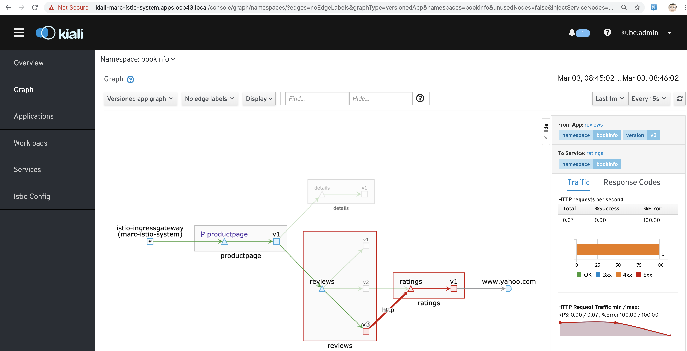
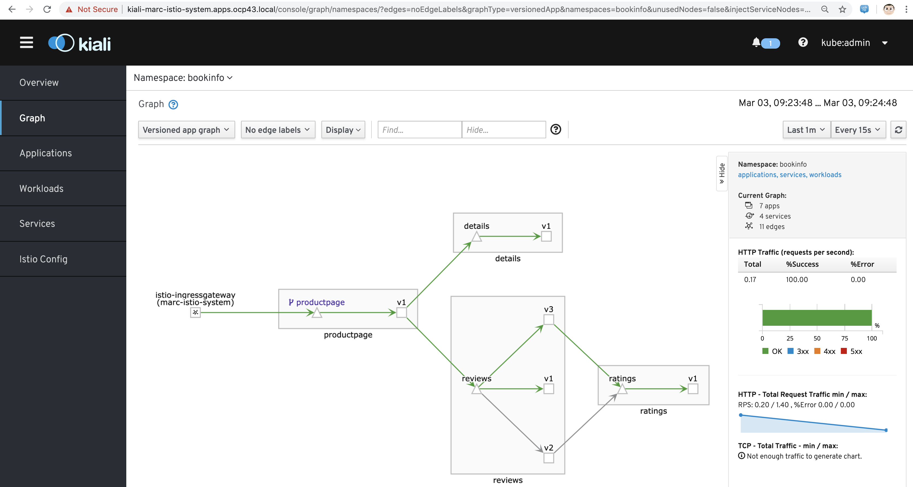

== White/Black Listing

----
This task shows how to control access to a service using 
simple denials, 
attribute-based white or black listing, 
or IP-based white or black listing.
----

----
Ensure that policy check are NOT disabled
oc get cm -n marc-istio-system istio -o jsonpath='{.data.mesh}' | grep disablePolicyChecks
disablePolicyChecks: false
----

----
Example: block traffic to version 3 of reviews
----

----
oc describe Gateway
Name:         bookinfo-gateway
Namespace:    bookinfo
Labels:       <none>
Annotations:  kubectl.kubernetes.io/last-applied-configuration:
                {"apiVersion":"networking.istio.io/v1alpha3","kind":"Gateway","metadata":{"annotations":{},"name":"bookinfo-gateway","namespace":"bookinfo...
API Version:  networking.istio.io/v1alpha3
Kind:         Gateway
Metadata:
  Creation Timestamp:  2020-02-26T03:44:29Z
  Generation:          1
  Resource Version:    5357251
  Self Link:           /apis/networking.istio.io/v1alpha3/namespaces/bookinfo/gateways/bookinfo-gateway
  UID:                 d0894e20-527a-4575-8c9f-3ce4270e734e
Spec:
  Selector:
    Istio:  ingressgateway
  Servers:
    Hosts:
      *
    Port:
      Name:      http
      Number:    80
      Protocol:  HTTP
Events:          <none>
----

----
oc describe VirtualService
Name:         bookinfo
Namespace:    bookinfo
Labels:       <none>
Annotations:  kubectl.kubernetes.io/last-applied-configuration:
                {"apiVersion":"networking.istio.io/v1alpha3","kind":"VirtualService","metadata":{"annotations":{},"name":"bookinfo","namespace":"bookinfo"...
API Version:  networking.istio.io/v1alpha3
Kind:         VirtualService
Metadata:
  Creation Timestamp:  2020-02-26T03:44:29Z
  Generation:          1
  Resource Version:    5357253
  Self Link:           /apis/networking.istio.io/v1alpha3/namespaces/bookinfo/virtualservices/bookinfo
  UID:                 7955c118-c25a-4dd2-a7aa-45545793e9e7
Spec:
  Gateways:
    bookinfo-gateway
  Hosts:
    *
  Http:
    Match:
      Uri:
        Exact:  /productpage
      Uri:
        Exact:  /login
      Uri:
        Exact:  /logout
      Uri:
        Prefix:  /api/v1/products
    Route:
      Destination:
        Host:  productpage
        Port:
          Number:  9080
----

----
oc describe DestinationRule
Name:         details
Namespace:    bookinfo
Labels:       <none>
Annotations:  kubectl.kubernetes.io/last-applied-configuration:
                {"apiVersion":"networking.istio.io/v1alpha3","kind":"DestinationRule","metadata":{"annotations":{},"name":"details","namespace":"bookinfo"...
API Version:  networking.istio.io/v1alpha3
Kind:         DestinationRule
Metadata:
  Creation Timestamp:  2020-02-26T03:46:52Z
  Generation:          1
  Resource Version:    5359178
  Self Link:           /apis/networking.istio.io/v1alpha3/namespaces/bookinfo/destinationrules/details
  UID:                 b608e293-46f2-4a2a-8f23-56dcf0d7ad86
Spec:
  Host:  details
  Subsets:
    Labels:
      Version:  v1
    Name:       v1
    Labels:
      Version:  v2
    Name:       v2
Events:         <none>

Name:         productpage
Namespace:    bookinfo
Labels:       <none>
Annotations:  kubectl.kubernetes.io/last-applied-configuration:
                {"apiVersion":"networking.istio.io/v1alpha3","kind":"DestinationRule","metadata":{"annotations":{},"name":"productpage","namespace":"booki...
API Version:  networking.istio.io/v1alpha3
Kind:         DestinationRule
Metadata:
  Creation Timestamp:  2020-02-26T03:46:52Z
  Generation:          1
  Resource Version:    5359175
  Self Link:           /apis/networking.istio.io/v1alpha3/namespaces/bookinfo/destinationrules/productpage
  UID:                 d18a3b84-02c2-438e-ae63-49e5fcecc8d7
Spec:
  Host:  productpage
  Subsets:
    Labels:
      Version:  v1
    Name:       v1
Events:         <none>

Name:         ratings
Namespace:    bookinfo
Labels:       <none>
Annotations:  kubectl.kubernetes.io/last-applied-configuration:
                {"apiVersion":"networking.istio.io/v1alpha3","kind":"DestinationRule","metadata":{"annotations":{},"name":"ratings","namespace":"bookinfo"...
API Version:  networking.istio.io/v1alpha3
Kind:         DestinationRule
Metadata:
  Creation Timestamp:  2020-02-26T03:46:52Z
  Generation:          1
  Resource Version:    5359177
  Self Link:           /apis/networking.istio.io/v1alpha3/namespaces/bookinfo/destinationrules/ratings
  UID:                 639fa9e7-abed-4239-8521-c039b84337f9
Spec:
  Host:  ratings
  Subsets:
    Labels:
      Version:  v1
    Name:       v1
    Labels:
      Version:  v2
    Name:       v2
    Labels:
      Version:  v2-mysql
    Name:       v2-mysql
    Labels:
      Version:  v2-mysql-vm
    Name:       v2-mysql-vm
Events:         <none>

Name:         reviews
Namespace:    bookinfo
Labels:       <none>
Annotations:  kubectl.kubernetes.io/last-applied-configuration:
                {"apiVersion":"networking.istio.io/v1alpha3","kind":"DestinationRule","metadata":{"annotations":{},"name":"reviews","namespace":"bookinfo"...
API Version:  networking.istio.io/v1alpha3
Kind:         DestinationRule
Metadata:
  Creation Timestamp:  2020-02-26T03:46:52Z
  Generation:          1
  Resource Version:    5359176
  Self Link:           /apis/networking.istio.io/v1alpha3/namespaces/bookinfo/destinationrules/reviews
  UID:                 1f523c02-4a42-40fa-9009-9529f8b7a059
Spec:
  Host:  reviews
  Subsets:
    Labels:
      Version:  v1
    Name:       v1
    Labels:
      Version:  v2
    Name:       v2
    Labels:
      Version:  v3
    Name:       v3
Events:         <none>
----

----
As we'll create white/blacklisting rules based on our pods' labels, let's see what the labels are:
oc get pods --show-labels
NAME                              READY   STATUS    RESTARTS   AGE   LABELS
details-v1-789c5f58f4-p5zlt       2/2     Running   0          13h   app=details,pod-template-hash=789c5f58f4,version=v1
productpage-v1-856c8cc5d8-kn8s7   2/2     Running   0          13h   app=productpage,pod-template-hash=856c8cc5d8,version=v1
ratings-v1-5786768978-mf6zl       2/2     Running   0          38m   app=ratings,pod-template-hash=5786768978,version=v1
reviews-v1-5874566865-kp2jm       2/2     Running   0          13h   app=reviews,pod-template-hash=5874566865,version=v1
reviews-v2-86865fc7d9-b7kbw       2/2     Running   0          13h   app=reviews,pod-template-hash=86865fc7d9,version=v2
reviews-v3-8d4cbbbbf-zmhjk        2/2     Running   0          13h   app=reviews,pod-template-hash=8d4cbbbbf,version=v3
----

----
Create a rule that denies traffic from the specified sources to version of reviews

apiVersion: "config.istio.io/v1alpha2"
kind: handler
metadata:
  name: denyreviewsv3handler
spec:
  compiledAdapter: denier
  params:
    status:
      code: 7
      message: Not allowed
---
apiVersion: "config.istio.io/v1alpha2"
kind: instance
metadata:
  name: denyreviewsv3request
spec:
  compiledTemplate: checknothing
---
apiVersion: "config.istio.io/v1alpha2"
kind: rule
metadata:
  name: denyreviewsv3
spec:
  match: destination.labels["app"] == "ratings" && source.labels["app"]=="reviews" && source.labels["version"] == "v3"
  actions:
  - handler: denyreviewsv3handler
    instances: [ denyreviewsv3request ]
----

----
Generate traffic
export GATEWAY_URL=$(oc -n marc-istio-system  get route istio-ingressgateway -o jsonpath='{.spec.host}')

echo "GATEWAY_URL=$GATEWAY_URL"
GATEWAY_URL=istio-ingressgateway-marc-istio-system.apps.ocp43.local

cat generate-traffic.sh
#!/bin/bash

while [ true ]
do
    curl -o /dev/null -s -w "%{http_code}\n" http://$GATEWAY_URL/productpage
    sleep .1
done
----

----
Use Kiali to check that no traffic is going 
from version 3 of reviews 
to the ratings workload 
as per our blacklisting rule above.

The rule matches requests coming from the workload reviews with label v3 to the workload ratings.

This rule uses the denier adapter to deny requests coming from version v3 of the reviews service:
destination.labels["app"] == "ratings" && source.labels["app"]=="reviews" && source.labels["version"] == "v3"
----

----
Remove the blacklisting rule:
oc delete -f mixer-rule-deny-label.yaml
handler.config.istio.io "denyreviewsv3handler" deleted
instance.config.istio.io "denyreviewsv3request" deleted
rule.config.istio.io "denyreviewsv3" deleted
----

----

----
Use Kiali to check that traffic is now allowed to go
from version 3 of reviews 
to the ratings workload 
----

