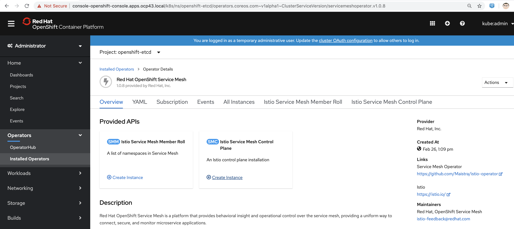
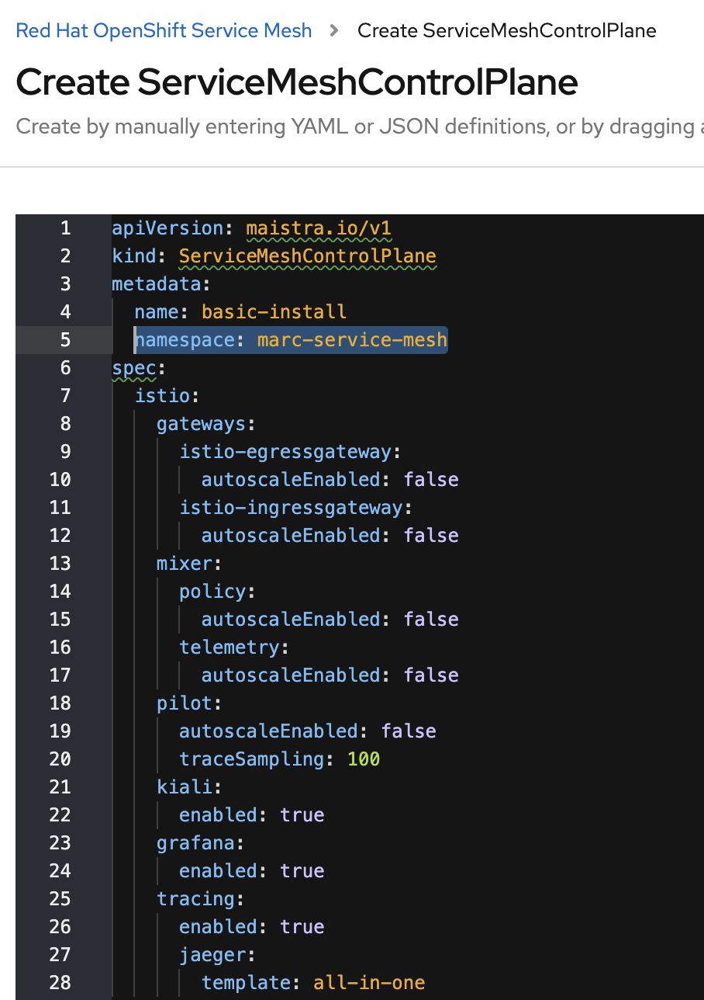
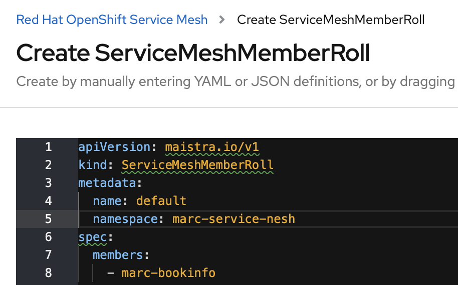

== Installing Service Mesh on OpenShift 4.3

----
From the Operator Hub, install the Serverless Operator (This will install the Service Mesh Operator as well)
----

----
Create a new project for the service mesh control plane
oc new-project marc-service-mesh
----

----
Click on "Create instance" under "Istio Service Mesh Control Plane"
----

----
Replace namespace with the name of the project you just created
----

----
Check that all service mesh control plane pods are running 

oc project marc-service-mesh
Already on project "marc-service-mesh" on server "https://api.ocp43.local:6443".

oc get pods
NAME                                     READY   STATUS    RESTARTS   AGE
grafana-5998d4686d-sls4f                 2/2     Running   0          97s
istio-citadel-7b8ffb7d4f-wf747           1/1     Running   0          3m44s
istio-egressgateway-5f47d5bd7b-mqgfd     1/1     Running   0          2m9s
istio-galley-7d4d6b694d-p54t2            1/1     Running   0          3m13s
istio-ingressgateway-694d57d7c8-bts8p    1/1     Running   0          2m9s
istio-pilot-7646bdbf5b-hldgz             2/2     Running   0          2m44s
istio-policy-5d97d6b974-6k2kn            2/2     Running   0          2m57s
istio-sidecar-injector-7f4698b57-kwh8m   1/1     Running   0          116s
istio-telemetry-7b97757c4b-nbvc4         2/2     Running   0          2m57s
jaeger-694b9d459-xjz6v                   2/2     Running   0          3m18s
kiali-86dc5bd4df-vhd5d                   1/1     Running   0          62s
prometheus-5c7bffd48d-gfs9j              2/2     Running   0          3m33s
----

----
Click on "Create instance" under "Istio Service Mesh Member Roll"
----

----
Replace namespace with the name of the service mesh control plane project you created
Under members, add the names of the projects where you'll deploy service mesh apps managed by the above control plane.
(With OpenShift Service Mesh, you can have multiple control planes each managing multiple namespaces).
----

