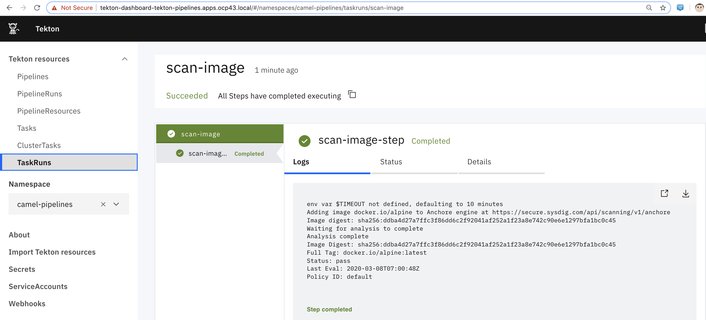
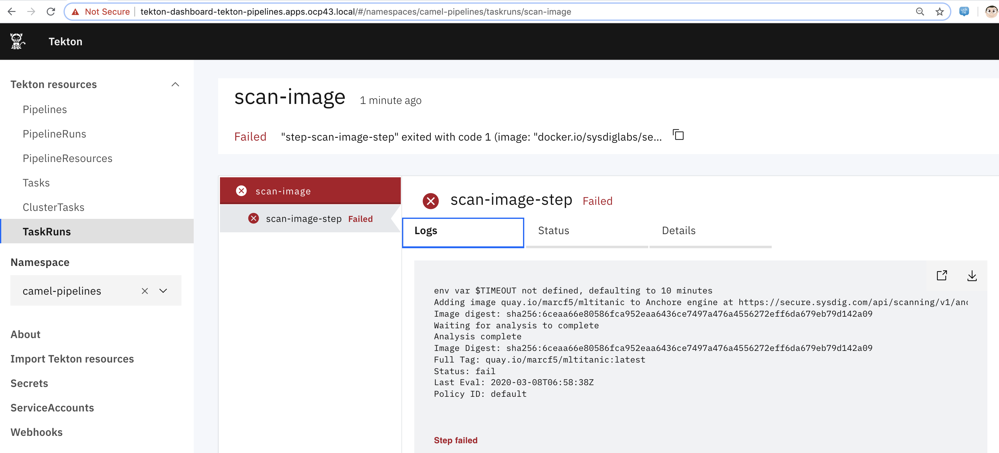

----
wget https://raw.githubusercontent.com/marcredhat/workshop/master/tekton/sysdig_secure_image_scanning/task.yaml
wget https://raw.githubusercontent.com/marcredhat/workshop/master/tekton/sysdig_secure_image_scanning/taskrun.yaml
oc delete -f task.yaml
oc delete -f taskrun.yaml
----

----
Edit task.yaml: 
value: "docker.io/alpine" 
(this should pass the Sysdig secure scan)
or
value: quay.io/marcf5/mltitanic 
(this should NOT pass the Sysdig secure scan
----

----
Edit task.yaml: 
Use your Sysdig Secure token from https://secure.sysdig.com (Settings / Sysdig Secure API Token)
----

----
oc create -f task.yaml
oc create  -f taskrun.yaml
----

